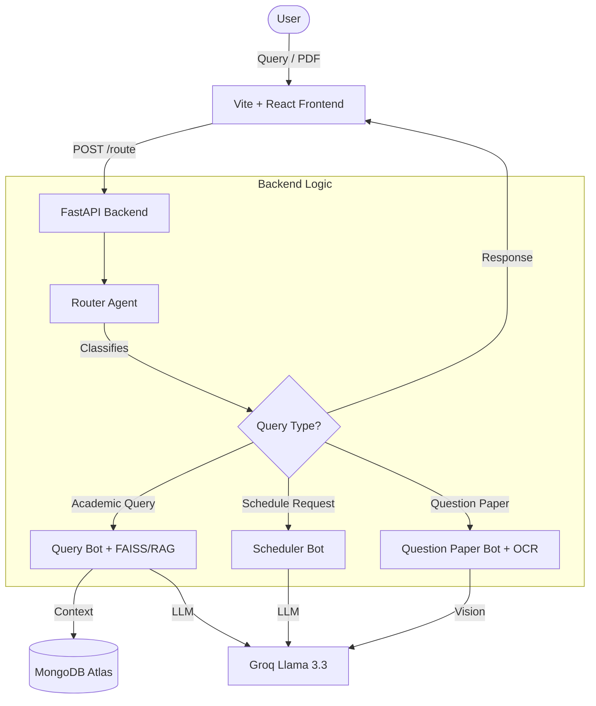

# IITI Tutor - Nexus AI

Nexus is an advanced AI academic assistant designed specifically for the IITI community. It features a Retrieval-Augmented Generation (RAG) system for curriculum queries, an automated scheduler, and a vision-powered question paper assistant.

## System Architecture



## Features

- **Academic Navigator**: Get detailed information about course codes (e.g., EE101, CS202), syllabus details, and recommended reading material.
- **Smart Scheduler**: Generate personalized, realistic study plans based on your specific tasks and time constraints.
- **Exam Assistant**: Upload question papers (PDF) to:
  - Generate comprehensive solutions with step-by-step explanations.
  - Create similar mock papers for practice.

## Project Structure

- `backend/`: FastAPI server modularized into services and core logic.
- `frontend/`: Vite + React + TypeScript frontend with a premium, responsive UI.

## Local Setup

### System Prerequisites
- **Python 3.10+**
- **Tesseract OCR**: Required for reading PDFs. [Download here](https://github.com/UB-Mannheim/tesseract/wiki).
- **Node.js & npm**: For the frontend.

### 1. Backend Configuration
1. Navigate to the backend directory: `cd backend`
2. Create and activate a virtual environment:
   ```bash
   python -m venv venv
   source venv/bin/activate  # On Windows: .\venv\Scripts\activate
   ```
3. Install dependencies:
   ```bash
   python -m pip install -r requirements.txt
   ```
4. Create a `.env` file in `backend/`:
   ```env
   GROQ_API_KEY=your_groq_api_key
   MONGO_URI=your_mongodb_uri
   ```
5. Start the server:
   ```bash
   python main.py
   ```

### 2. Frontend Configuration
1. Navigate to the frontend directory: `cd frontend`
2. Install dependencies:
   ```bash
   npm install
   ```
3. Start the development server:
   ```bash
   npm run dev
   ```
4. Access the app at `http://localhost:8080` (or the port shown in your terminal).

## Deployment

- **Backend**: Ready for **Render** using the provided `Dockerfile`.
- **Frontend**: Ready for **Vercel**. Ensure a `VITE_BACKEND_URL` environment variable is set on Vercel.

## Technologies Used

- **AI**: Groq (Llama 3.1/3.3), Sentence Transformers.
- **Database/Storage**: MongoDB Atlas, FAISS (Vector DB).
- **Processing**: PyMuPDF (fitz), Tesseract OCR.
- **Frontend**: React, Tailwind CSS, Lucide icons, KaTeX.
- **Backend**: FastAPI, Uvicorn, Motor.

## Contributing

We welcome contributions from the IITI community and beyond! To contribute:

1.  **Fork** the repository.
2.  **Create a feature branch**: `git checkout -b feature/amazing-feature`
3.  **Commit your changes**: `git commit -m 'Add amazing feature'`
4.  **Push to the branch**: `git push origin feature/amazing-feature`
5.  **Open a Pull Request**.

Please ensure you follow the local setup instructions before submitting a PR. For major changes, please open an issue first to discuss what you would like to change.

## Collaborators

- [Naman V Shetty](https://github.com/namanvshetty)
- [Ankush](https://github.com/ankush-10010)

## License

This project is licensed under the MIT License - see the LICENSE file for details.
