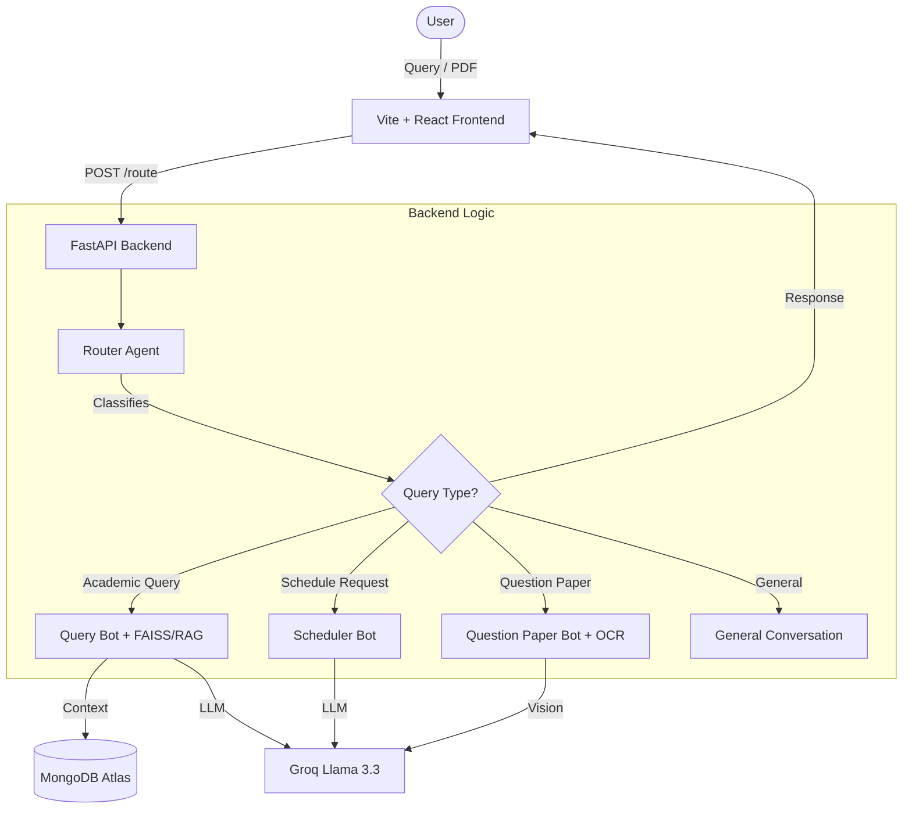

# IITI Tutor - NEXUS AI

<div align="center">


**An intelligent AI-powered academic assistant for the IIT Indore community**

[](https://fastapi.tiangolo.com/)
[](https://reactjs.org/)
[](https://www.mongodb.com/)
[](https://groq.com/)

</div>

---

## 🌟 Features

| Feature | Description |
|---------|-------------|
| **📚 Academic Navigator** | Get detailed information about course codes (EE101, CS202), syllabus details, and recommended reading material using RAG |
| **📅 Smart Scheduler** | Generate personalized, realistic study plans based on your tasks and time constraints |
| **📝 Exam Assistant** | Upload question papers (PDF) to get solutions or generate similar practice papers |

---

## 🏗️ System Architecture



---

## 📁 Project Structure

```
iiti_tutor/
├── backend/
│   ├── core/
│   │   ├── config.py          # Environment & app configuration
│   │   └── database.py        # MongoDB connection handler
│   ├── services/
│   │   ├── router_agent.py    # Query classification & routing
│   │   ├── query_bot.py       # RAG-based curriculum queries
│   │   ├── question_bot.py    # PDF processing & OCR
│   │   ├── scheduler_bot.py   # Study plan generation
│   │   └── history.py         # Chat history management
│   ├── utils/
│   │   └── memory.py          # Memory monitoring utilities
│   ├── main.py                # FastAPI application entry
│   ├── requirements.txt       # Python dependencies
│   ├── Dockerfile             # Container configuration
│   └── .env                   # Environment variables (create this)
│
└── frontend/
    ├── src/
    │   ├── components/        # React components
    │   ├── App.tsx            # Main application
    │   └── index.css          # Global styles
    ├── package.json           # Node dependencies
    └── vite.config.ts         # Vite configuration
```

---

## 🚀 Quick Start

### Prerequisites

| Requirement | Version | Notes |
|------------|---------|-------|
| Python | 3.10+ | Required |
| Node.js | 18+ | For frontend |
| Tesseract OCR | Latest | [Download here](https://github.com/UB-Mannheim/tesseract/wiki) |

### 1. Clone the Repository

```bash
git clone https://github.com/your-username/iiti_tutor.git
cd iiti_tutor
```

### 2. Backend Setup

```bash
cd backend

# Create virtual environment
python -m venv venv
source venv/bin/activate  # Windows: .\venv\Scripts\activate

# Install dependencies
pip install -r requirements.txt

# Create .env file (see Environment Variables section)
cp .env.example .env  # Or create manually

# Start the server
python main.py
```

### 3. Frontend Setup

```bash
cd frontend

# Install dependencies
npm install

# Start development server
npm run dev
```

Access the application at `http://localhost:5173`

---

## ⚙️ Environment Variables

Create a `.env` file in the `backend/` directory:

```env
# Required - API Keys
GROQ_API_KEY=your_groq_api_key_here
MONGO_URI=mongodb+srv:...

# Optional - Configuration
DATABASE_NAME=IITI_Tutor_DB
DEBUG=false
```

| Variable | Required | Description |
|----------|----------|-------------|
| `GROQ_API_KEY` | ✅ | API key from [Groq Console](https://console.groq.com/) |
| `MONGO_URI` | ✅ | MongoDB Atlas connection string |
| `DATABASE_NAME` | ❌ | Database name (default: `IITI_Tutor_DB`) |
| `DEBUG` | ❌ | Set to `true` for local development (disables secure cookies) |

> [!IMPORTANT]
> For local development, set `DEBUG=true` in your `.env` file to enable cookies without HTTPS.

---

## 📡 API Documentation

### Endpoints

| Method | Endpoint | Description |
|--------|----------|-------------|
| `GET` | `/health` | Health check |
| `POST` | `/route` | Main query endpoint |

### POST /route

**Request (Form Data):**
```
prompt: string (required) - User's query
file: File (optional) - PDF file for question paper processing
```

**Response:**
- JSON with `text` field for text responses
- Multipart response for PDF + text
- PDF stream for generated documents

### Example Usage

```bash
# Health check
curl http://localhost:8000/health

# Text query
curl -X POST http://localhost:8000/route \
  -F "prompt=What is EE101 about?"

# PDF upload
curl -X POST http://localhost:8000/route \
  -F "prompt=Solve these questions" \
  -F "file=@question_paper.pdf"
```

---

## 🧪 Development

### Running in Debug Mode

```bash
# Set in .env
DEBUG=true

# Start with auto-reload
uvicorn main:app --reload --port 8000
```

### Code Quality

```bash
# Backend linting
cd backend
pip install ruff
ruff check .

# Frontend linting
cd frontend
npm run lint
```

---

## 🐳 Deployment

### Backend (Docker / Render)

```bash
cd backend
docker build -t nexus-backend .
docker run -p 8000:8000 --env-file .env nexus-backend
```

### Frontend (Vercel)

Set environment variable on Vercel:
```
VITE_BACKEND_URL=https://your-backend-url.onrender.com
```

---

## 🛠️ Troubleshooting

| Issue | Solution |
|-------|----------|
| `CONFIGURATION ERROR: GROQ_API_KEY is not set` | Create `.env` file with valid `GROQ_API_KEY` |
| `CONFIGURATION ERROR: MONGO_URI is not set` | Add `MONGO_URI` to your `.env` file |
| Cookies not working locally | Set `DEBUG=true` in `.env` |
| OCR not extracting text | Ensure Tesseract is installed and in PATH |
| `ModuleNotFoundError` | Activate virtual environment and reinstall requirements |

---

## 🔧 Technologies

| Category | Technologies |
|----------|--------------|
| **AI/ML** | Groq (Llama 3.1/3.3), Sentence Transformers, FAISS |
| **Backend** | FastAPI, Uvicorn, Motor (async MongoDB) |
| **Frontend** | React, TypeScript, Vite, Tailwind CSS |
| **Processing** | PyMuPDF, Tesseract OCR, ReportLab |
| **Database** | MongoDB Atlas |

---

## 🤝 Contributing

1. **Fork** the repository
2. **Create** a feature branch: `git checkout -b feature/amazing-feature`
3. **Commit** your changes: `git commit -m 'Add amazing feature'`
4. **Push** to the branch: `git push origin feature/amazing-feature`
5. **Open** a Pull Request

> [!TIP]
> For major changes, please open an issue first to discuss what you would like to change.

---

## 👥 Collaborators

- [Naman V Shetty](https://github.com/namanvshetty)
- [Ankush](https://github.com/ankush-10010)

---

## 📄 License

This project is licensed under the MIT License - see the [LICENSE](LICENSE) file for details.

---

<div align="center">

**Made with ❤️ for the IITI Community**

</div>
